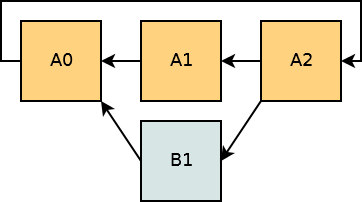

# EIP-100: Change difficulty adjustment to target mean block time including uncles


## Abstract
이 문서는 엉클 블록(uncle block) 마이닝 전략을 고려한 이더해시 난이도 조정 알고리즘 수정 제안인 EIP-100을 분석합니다. 최근 작업 증명(PoW) 난이도 조정 알고리즘에 대한 관심이 증가함에 따라, 난이도 조정을 제안한 EIP-2에 이어 난이도 조정 알고리즘을 개선하는 EIP-100을 분석하게 되었습니다.

## Motivation

엉클블록(uncle block)은 블록의 유효성은 통과되었지만 최종 블록으로 인정받지 못한 블록들을 의미합니다. 일반적으로는 네트워크 지연 등으로 인해 최종 블록이 전달되기 전에 또 다른 블록이 생성되어 발생합니다. 

그러나 2016년 4월 의도적으로 엉클 블록을 채굴하는 채굴 전략이 발견되었습니다. 엉클 블록 또한 유효성이 통과 된 만큼 엉클 블록을 생성하는 데도 많은 비용이 소모됩니다. 따라서 이더리움은 엉클 블록에 대해서도 블록 보상을 제공합니다. 엉클 블록의 보상은 현재 블록 보상의 n/8이며, 여기서 엉클이 조카 블록에 포함되면 n=7, 조카 블록의 자식이 포함되면 n=6의 블록 보상을 받습니다. 엉클 마이닝 전략은 이더리움의 이러한 보상 정책을 악용합니다. 

엉클 마이닝 전략은 자신의 블록을 엉클 보상을 얻기 위해 자신의 블록을 의도적으로 다른 노드들에게 전달하지 않고 엉클 블록으로 강제하는 동시에 블록이 블록 난이도 조정에 기여하는 것을 방지합니다. 이러한 엉클 블록의 생성은 작업증명 보안에는 큰 영향을 끼치진 않기 때문에 사실 보안 취약점이라고 보기는 어렵습니다. 그러나 이는 블록체인에는 기여하지 않으면서 채굴 보상을 가져간다는 점에서 불공정한 이점, 설계 결함 및 네트워크 안정성에 대한 위험으로 볼 수 있습니다. 

엉클 블록 채굴 전략은 단순하게 가장 긴 체인을 확장하는 블록 대신 엉클 블록을 채굴하는 것입니다. 엉클 블록만 채굴하려면 채굴자는 자신이 해결하는 블록이 가장 긴 체인(가장 가중치가 높은 체인)에 포함되지 않도록 해야 합니다. 예를 들어, 엉클 블록 마이너는 블록을 가장 먼저 채굴에 성공하였더라도 다른 채굴자가 적법한 블록을 채굴하고 모든 피어가 해당 적법한 블록(동일한 높이)을 받을 때까지 기다렸다가 자신의 엉클 블록을 브로드캐스팅 합니다.  

##### 엉클 마이닝 알고리즘
```
1. B를 최고의 체인 팁으로 설정합니다("팁"은 체인에 마지막으로 추가된 블록임)
2. 블록 C 채굴을 시작하고 C는 B의 자식 블록입니다.
3. 블록 C에 대한 정답 해시가 발견되면(블록 채굴에 성공하면) 블록 C와 정답 해시를 저장합니다 (그러나 블록을 브로드 캐스트하지 않음).
4. 대부분의 피어 노드들이 C의 블록 높이에서 C와 다른 적법한 블록을 가지고있는 경우 :
      1. 저장된 모든 하위 블록을 브로드캐스팅합니다.
      2. 1단계로 이동
5. 3단계로 이동합니다
```

<p align="center">
  
</p>

<p align="center">엉클 마이닝 알고리즘 예시</p>

엉클 마이닝 알고리즘을 분석한 이론적 결과는 특정 최적 조건에서 엉클 마이닝 채굴자의 해시 파워가 전체의 12.5% 이상일 때 엉클 마이닝이 수익성이 있음을 보여주며, 2016년 이더리움의 환경을 기준으로 채굴자가 수익을 얻기 위한 임계치는 20%-37% 범위에 있다고 추정되었습니다.

엉클 마이닝 알고리즘이 발생하는 원인은 다음과 같습니다. 

가장 큰 원인은 난이도를 계산하는 데 사용되는 이 당시의 이더리움 알고리즘은 상위 블록 시간만을 기반으로 한다는 점입니다. 기본적으로 부모 블록의 타임스탬프가 너무 가까우면 난이도가 증가하고 너무 멀면 난이도가 감소합니다. 이 과정에서 엉클 블록에 따른 체인 무게는 고려하지 않습니다. 이와 다르게, 비트코인 난이도 조정 알고리즘의 경우 마지막 2016개 블록을 가져와 난이도를 조정하여 첫 번째 및 마지막 블록 타임스탬프를 사용하여 평균 14일 만에 다음 2016개 블록이 생성되도록 합니다. 만약 이더리움이 이처럼 비트코인과 비슷하지만 체인 가중치(무게/시간)를 기반으로 하는 알고리즘을 사용했다면 엉클 마이닝은 평균 블록 생성 속도를 높이지 않았을 것이고, 엉클 마이닝은 방지되었을 것입니다.

따라서 이러한 문제를 해결하기 위해서 EIP-100 이 제안되었습니다.

## Change

현재 블록의 난이도를 계산하는 공식은 다음과 같습니다.

$$
\text{block.diff} = \text{parent.diff} + \frac{\text{parent.diff}}{2048} \times \max\left(1 - \frac{\text{block.timestamp} - \text{parent.timestamp}}{10}, -99\right) + \text{int}\left(2^{\left(\frac{\text{block.number}}{100000} - 2\right)}\right)
$$

을 다음과 같이 변경합니다.

$$
\text{block.diff} = \text{parent.diff} + \frac{\text{parent.diff}}{2048} \times \max\left(\begin{cases} 
2 & \text{if len(parent.uncles)} \\ 1 & \text{otherwise}
\end{cases}- \frac{{\text{timestamp} - \text{parent.timestamp}}}{9}, -99 \right) + \text{int}\left(2^{\left(\frac{\text{block.number}}{100000} - 2\right)}\right)
$$

#### Code 

```go
// MakeDifficultyCalculatorU256 creates a difficultyCalculator with the given bomb-delay.
// the difficulty is calculated with Byzantium rules, which differs from Homestead in
// how uncles affect the calculation
func MakeDifficultyCalculatorU256(bombDelay *big.Int) func(time uint64, parent *types.Header) *big.Int {
	// Note, the calculations below looks at the parent number, which is 1 below
	// the block number. Thus we remove one from the delay given
	bombDelayFromParent := bombDelay.Uint64() - 1
	return func(time uint64, parent *types.Header) *big.Int {
		/*
			https://github.com/ethereum/EIPs/issues/100
			pDiff = parent.difficulty
			BLOCK_DIFF_FACTOR = 9
			a = pDiff + (pDiff // BLOCK_DIFF_FACTOR) * adj_factor
			b = min(parent.difficulty, MIN_DIFF)
			child_diff = max(a,b )
		*/
		x := (time - parent.Time) / 9 // (block_timestamp - parent_timestamp) // 9
		c := uint64(1)                // if parent.unclehash == emptyUncleHashHash
		if parent.UncleHash != types.EmptyUncleHash {
			c = 2
		}
		xNeg := x >= c
		if xNeg {
			// x is now _negative_ adjustment factor
			x = x - c // - ( (t-p)/p -( 2 or 1) )
		} else {
			x = c - x // (2 or 1) - (t-p)/9
		}
		if x > 99 {
			x = 99 // max(x, 99)
		}
		// parent_diff + (parent_diff / 2048 * max((2 if len(parent.uncles) else 1) - ((timestamp - parent.timestamp) // 9), -99))
		y := new(uint256.Int)
		y.SetFromBig(parent.Difficulty)    // y: p_diff
		pDiff := y.Clone()                 // pdiff: p_diff
		z := new(uint256.Int).SetUint64(x) //z : +-adj_factor (either pos or negative)
		y.Rsh(y, difficultyBoundDivisor)   // y: p__diff / 2048
		z.Mul(y, z)                        // z: (p_diff / 2048 ) * (+- adj_factor)

		if xNeg {
			y.Sub(pDiff, z) // y: parent_diff + parent_diff/2048 * adjustment_factor
		} else {
			y.Add(pDiff, z) // y: parent_diff + parent_diff/2048 * adjustment_factor
		}
		// minimum difficulty can ever be (before exponential factor)
		if y.LtUint64(minimumDifficulty) {
			y.SetUint64(minimumDifficulty)
		}
		// calculate a fake block number for the ice-age delay
		// Specification: https://eips.ethereum.org/EIPS/eip-1234
		var pNum = parent.Number.Uint64()
		if pNum >= bombDelayFromParent {
			if fakeBlockNumber := pNum - bombDelayFromParent; fakeBlockNumber >= 2*expDiffPeriodUint {
				z.SetOne()
				z.Lsh(z, uint(fakeBlockNumber/expDiffPeriodUint-2))
				y.Add(z, y)
			}
		}
		return y.ToBig()
	}
}

```

이 새로운 공식은 엉클 블록을 포함한 블록의 평균 생성 비율을 일정하게 유지하고, 이로 인해 상향 조작할 수 없는 매우 예측 가능한 엉클 블록 비율이 보장됩니다. 아래의 공식은 포함된 엉클 블록의 수를 정확하게 고려합니다:

$$
\max\left(1 + \text{len(parent.uncles)} - \left(\frac{{\text{timestamp} - \text{parent.timestamp}}} {9}\right), -99\right)
$$

k개의 엉클 블록이 정확히 같은 타임스탬프를 가진 k+1개의 블록 집합과 동등하다고 가정하는 것과 오차가 크지 않다는 것을 확인하였습니다. 그러나 정확한 엉클 블록의 갯수를 실제 난이도 조절 알고리즘에 활용할 경우 블록 헤더만이 아닌 블록 전체에 의존해야 하는 문제가 발생합니다. 따라서 우리는 위 공식이 아닌 블록 헤더에만 의존하여 근사치를 추정하는 첫번째 공식을 사용합니다. 

또한 추가적으로 분모를 10에서 9로 변경함으로써 평균 블록 시간이 업데이트 이전과 대략적으로 유지되도록 보장됩니다.

## Reference
https://eips.ethereum.org/EIPS/eip-100

https://bitslog.com/2016/04/28/uncle-mining-an-ethereum-consensus-protocol-flaw/

