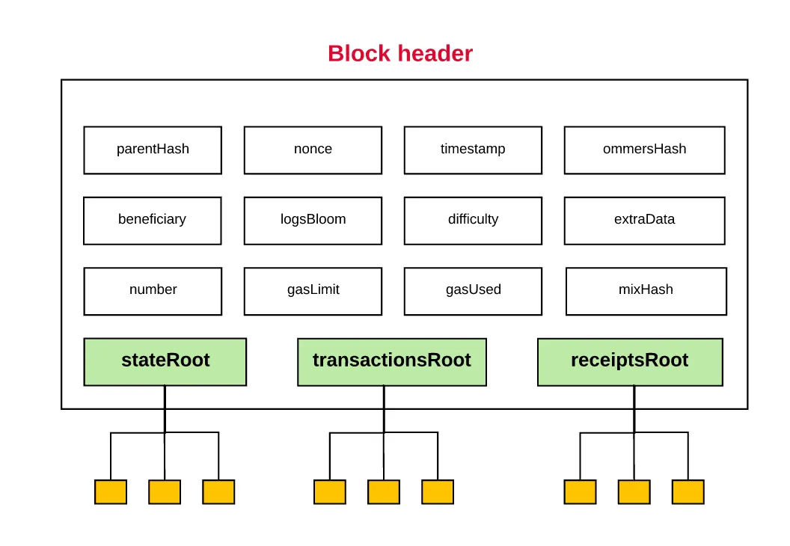

# EIP-225: Clique proof-of-authority consensus protocol


## Abstract
이 문서는 이더리움 테스트넷의 원할한 작동을 위해 제안된 권한증명(proof-of-authority) 합의 알고리즘인 Clique을 제안한 EIP-225를 서술하고 분석합니다. Clique는 신뢰받는 노드들만이 합의에 참여할 수 있도록 하는 합의 알고리즘이며, 이더리움의 구조를 해치지 않고 모든 클라이언트에 최소 비용으로 추가될 수 있습니다. 이 문서에서는 Clique의 등장 배경과 그 구조, 실제 코드의 구현까지 살펴봅니다.

## Motivation
이더리움 첫번째 공식 테스트넷은 작업 증명 테스트넷인 Morden이었습니다.
Morden 테스트셋은 2015년 7월부터 2016년 11월까지 진행되었으나, go-ethereum 과 parity 두 노드 클라이언트 간의 테스트넷 전용 합의 문제와 누적된 정크 데이터로 인해 중단되었습니다. 

이후 다음 작업증명 테스트넷인 Ropsten으로 새롭게 시작되었습니다.Ropsten은 2017년 2월 말까지 잘 진행되었는데, 악의적인 공격자들이 테스트넷이 낮은 난이도를 가진다는 점을 악용하여 블록 가스 한도를 470만 개에서 90억 개로 점차적으로 부풀린후, 거대한 스팸 트랜잭션을 전송했습니다. Ropsten팀은 2017년 3월 커뮤니티에서 기부한 GPU 해시 파워를 투입하여 네트워크를 되살리는 데 성공하였으나 이러한 문제를 해결하기 위해 테스트넷을 위한 합의 알고리즘의 필요성이 대두되었습니다. 

이러한 DDOS 공격의 근본 원인은 PoW 블록체인은 블록체인의 네트워크 해시파워 만큼의 보안성을 가지기 때문입니다. 새로운 테스트넷을 제네시스 블록에서 다시 시작해도 공격자가 전체 51% 이상의 해시파워를 소유한 경우 동일한 공격을 반복해서 할 수 있기 때문에 아무 것도 해결되지 않습니다. 테스트넷은 가치가 없는 네트워크이기 때문에 충분히 안전해질 만큼의 해시파워를 가지기는 어렵습니다. 

## Standardized proof-of-authority

PoA(proof-of-authority) 합의 알고리즘은 신뢰할 수 있는 서명자에 의해서만 블록이 발행될 수 있다는 아이디어를 기반으로 합니다. 또한 PoA의 주요 목표는 기존 이더리움 클라이언트에 구현하고 추가하는 것이 매우 간단함과 동시에 기존 동기화 방식에 호환되어야 한다는 것입니다. 

PoA는 인증된 서명자 목록을 가지고 있으며, 서명자들은 투표를 통해 서명자 목록에 서명자를 추가하고,제거할 수 있습니다.

## Repurposing header fields for signing and voting

최대한의 블록 헤더 데이터 구조 변경을 피하기 위해 블록 헤더의 32바이트 추가 데이터(extraData) 섹션을 활용합니다. 일반적으로는 채굴자들이 자신들의 클라이언트 버전을 추가하지만 다른 메세지를 추가해도 문제가 발생하지 않습니다. 채굴자 서명을 추가하기 위해 이 필드를 65바이트로 확장합니다. 필드 길이의 확장은 해싱 과정에서 길이가 고려되지 않으므로, 문제가 발생하지 않습니다. 이 필드를 통해 블록을 받는 노드들은 승인된 서명자 목록과 그들의 지갑주소를 확인할 수 있게 합니다. 

작업증명을 위해 존재하던 채굴자 필드와 논스 필드는 서명자 목록을 업데이트 하는 경우에 사용됩니다. 일반 블록에서는 두 필드 모두 '0'으로 설정됩니다. 그러나 목록을 변경하고 싶을 경우 채굴자 필드에 투표 대상 "서명자"를 추가하고, 논스 필드에 '0'과 '0xff...f' 로 찬/반 여부를 입력합니다. 이를 통해 모든 노드들은 투표를 집계하고, 동적인 서명자 목록을 유지합니다.

이러한 투표가 지속적으로 쌓이는 것을 막기 위해 ethash의 에폭 개념을 활용합니다. 에폭이 변경되면 대기중인 투표를 비우고, 이는 체크포인트로도 활용됩니다. 동기화 과정에서 모든 투표를 재생하지 않고 체크포인트 해시만을 기반으로 동기화가 가능해집니다. 또한 이는 제네시스 헤더가 체인을 초기 서명자 목록을 포함하여 완전하게 정의할 수 있습니다.(?) 

<p align="center">
  
</p>

<p align="center">이더리움 블록 헤더</p>

## 공격 가능성

#### 공격 시나리오1: 악의적인 서명자 
악의적인 사용자가 서명자 목록에 추가되거나 서명자의 키에 문제가 발생할 수 있습니다. 따라서 Clique는 N의 서명자 목록이 주어지면, 모든 서명자가 해당 시점의 전체 K 블록에서 하나의 블록만을 투표할 수 있게끔 합니다. 이는 피해를 제한하고, 악의적인 사용자를 투표로 축출할 수 있게 합니다. 

#### 공격 시나리오2: 서명자 검열
또다른 공격 방식은 서명자가 자신들을 제거하려고 시도하는 블록을 검열하는 경우입니다. 이를 방지하기 위해 서명자가 생성할수 있는 블록을 2/N 블록 당 하나로 제한합니다. 따라서 서명자는 검열하기 위해 51% 이상의 서명 계정을 통제해야 하며 이는 이미 게임에 진 경우입니다. 

#### 공격 시나리오3: 스팸 서명자
다른 방식은 계속 새로운 서명자를 추가하는 스팸 투표를 블록에 추가하는 것입니다. 노드는 모든 투표를 집계해야 함으로 이는 무한하게 증가될 수 있습니다. 때문에 앞서 설명한 에폭을 활용해 일정 시간이 지나면 투표가 종료되게끔 합니다. 

#### 공격 시나리오4: 동시 차단
최악의 경우 서명자 수가 N이고, 해당 시점의 경쟁하는 블록의 수가 K라면 N-K+1의 서명자들이 경쟁할 수 있습니다. 경쟁을 피하기 위해 서명자들이 블록에 약간의 더미 오프셋을 추가하는 시나리오가 있을 수 있습니다. 이는 드물지만 작은 포크를 발생시킬 수 있습니다. 따라서 이러한 경우가 적발되면 투표를 통해 축출합니다. 

## 블록 권한 부여
서명자의 블록 승인은 서명을 제외한 모든 블록 헤더의 내용을 포함하는 해시값을 서명하는 것을 의미합니다. 이는 서명을 포함하지 않으므로 최종 블록 해시와는 다릅니다. 이는 secp256k1곡선을 사용해 서명되며 서명은 extraData에 추가됩니다. 앞서 서술한 공격 시나리오의 해결책으로 서명자는 연속된 블록 중 하나만 서명할 수 있습니다. 채굴자들은 서명 차례가 결정되며 순서는 고정되어 있지 않지만 맞는 차례에 서명한 경우 가중치를 얻습니다.

다음과 같은 제안된 전략은 네트워크 트래픽과 작은 분기를 줄일 수 있으므로 최적의 서명 전략은 다음과 같습니다.

1. 다음 블록의 최적 서명 시간(parent + BLOCK_PERIOD)을 계산합니다.
2. 서명자가 차례일 경우, 최적 시가까지 대기하고 즉시 방송합니다.
3. 서명자가 차례가 아닐 경우, 서명을 rand(SIGNER_COUNT * 500ms)만큼 지연시킵니다.

## 서명자에 대한 투표
에폭이 변경되는 경우 확정되지 않은 모든 투표는 삭제되고 처음부터 시작됩니다. 에폭 변경 블록의 헤더에는 투표가 포함되서는 안됩니다. 다수결에 도달한 투표은 즉시 효력을 발생합니다. 유효하지 않은 투표는 구현의 단순화를 위해 처벌받지 않습니다.

####  계단식 투표
서명자를 추방할 때 복잡한 경우가 발생할 수 잇습니다. 이전에 승인된 서명자가 제거되면 제안 승인에 필요한 서명자가 줄어들어 보류중인 제안이 다수결에 도달해 새 제안이 통과되는 상황이 발생합니다.

충돌하는 여러 제안이 동시에 통과되는경우 서명자가 자신이 생성한 모든 블록에서 자신의 투표를 뒤집을 수 있기 때문에, 어떤 제안을 우선해야 하는지는 명확하지 않습니다. 따라서 Clique는 이러한 문제를 해결하기 위해 블록의 투표 대상자(수혜자)만이 목록에서 제거되거나 삭제될 수 있도록 합니다. 과반에 도달한 다른 서명자가 있더라도 반영하지 않습니다.

####  투표 전략
블록체인에는 변경사항이 발생할 수 있으므로 투표한 블록이 최종 체인에 포함되지 않는 경우가 생길 수 있습니다. 


블록체인은 작은 재구성이 발생할 수 있으므로, “투표하고 잊기”라는 단순한 투표 메커니즘은 최적이 아닐 수 있습니다. 왜냐하면 단일 투표가 포함된 블록이 최종 체인에 포함되지 않을 수 있기 때문입니다. 따라서 투표를 하였더라도 해당 투표 내용을 즉시 제거하지 않고, "제안"으로 남겨 목록을 유지하도록 하여 재구성이 발생하더라도 다시 투표할 수 있도록 합니다.
 
####  사양 및 변경사항
이더리움 헤더의 용도는 다음과 같이 변경됩니다.

<b>miner(수혜자)</b>: 승인된 서명자 목록 수정을 제안할 주소입니다. 일반적으로 0으로 채워야 하며 투표하는 동안에만 수정되어야 하지만, 0이 아닌 값도 복잡성을 피하기 위해 허용됩니다. 그러나 에폭이 전환되는 경우에는 항상 0 값만이 허용됩니다. 블록의 트랜잭션 실행은 실제 블록 서명자(extraData에 위치한)가 실행하며 트랜잭션 수수료는 서명자 계정에 전달됩니다.

<b>nonce</b>: 논스는 블록 서명자의 제안이 포함됩니다.  
기존 서명자에 대한 권한 취소를 제안할 경우 NONCE_DROP를 포함하며, 새 서명자로 권한 부여를 제안하는 경우 NONCE_AUTH를 포함합니다. 에폭이 변경되는 블록의 경우에는 0 값 만을 허용합니다. 

<b>extraData</b>: EXTRA_VANITY와 EXTRA_SEAL가 포함된 필드입니다. 처음 EXTRA_VANITY에는 서명자 고유(Vanity) 데이터가 포함되며, 마지막 EXTRA_SEAL에는 헤더를 봉인하는 서명자의 서명이 저장됩니다. 
체크포인트 블록에서는 두 그 사이에 서명자 목록(N*20 bytes)을 포함해야 합니다. 

<b>mixHash</b>: 믹스 해시는 포크 방지 용으로 사용되며, DAO 동안의 extra-data와 유사합니다.


<b>ommersHash</b>: 작업증명이 아니므로 의미가 없기 떄문에 엉클 해시와 동일합니다.


<b>timestamp</b>: 목표 블록 시간 이상이어야 합니다. 

<b>difficulty</b>: 차례에 따라 DIFF_NOTURN 또는 DIFF_INTURN을 저장합니다.

코드상에 추가된 구현상의 상수와 구조들은 다음과 같습니다. 

consensus/clique/clique.go
```go
...
const (
	
	checkpointInterval = 1024 // Number of blocks after which to save the vote snapshot to the database
	inmemorySnapshots  = 128  // Number of recent vote snapshots to keep in memory
	inmemorySignatures = 4096 // Number of recent block signatures to keep in memory

	wiggleTime = 500 * time.Millisecond // Random delay (per signer) to allow concurrent signers
)

// Clique proof-of-authority protocol constants.
var (
	//EPOCH_LENGTH: 보류 중인 투표를 체크포인트하고 재설정할 수 있는 블록 수입니다. 메인넷 ethash epoch와 유사하게 유지되도록 30000으로 제안되었습니다.
	epochLength = uint64(30000) // Default number of blocks after which to checkpoint and reset the pending votes

	//EXTRA_VANITY: 서명자 고유(Vanity)를 위해 예약된 추가 데이터 접두어 바이트 수를 32 bytes로 고정합니다
	extraVanity = 32                     // Fixed number of extra-data prefix bytes reserved for signer vanity
	
	//EXTRA_SEAL: 서명자 봉인을 위해 예약된 추가 데이터 접미사 바이트 수를 65 bytes로 고정했습니다.서명이  표준 secp256k1 곡선을 기준으로 고정되며 제네시스 블록에 0으로 채워져 있습니다.
	extraSeal   = crypto.SignatureLength // Fixed number of extra-data suffix bytes reserved for signer seal

	//NONCE_AUTH: 새 서명자 추가에 투표할 매직 논스 번호입니다.0xffffffffffffffff
	nonceAuthVote = hexutil.MustDecode("0xffffffffffffffff") // Magic nonce number to vote on adding a new signer

	//NONCE_DROP: 서명자 제거에 투표할 매직 논스 번호입니다.0x0000000000000000
	nonceDropVote = hexutil.MustDecode("0x0000000000000000") // Magic nonce number to vote on removing a signer.

	//UNCLE_HASH: 엉클블록은 Clique 에서 의미가 없기 떄문에 Keccak256(RLP([]))로 고정합니다. 
	uncleHash = types.CalcUncleHash(nil) // Always Keccak256(RLP([])) as uncles are meaningless outside of PoW.

  //DIFF_INTURN: 차례가 포함된 서명이 포함된 블록에 대한 블록 점수(난이도)입니다.약간의 선호도를 표시하기 위해 2로 표현됩니다.
	diffInTurn = big.NewInt(2) // Block difficulty for in-turn signatures

  //DIFF_NOTURN: 순서를 벗어난 서명이 포함된 블록에 대한 블록 점수(난이도)입니다. 임의의 기준선 상수여야 하기 때문에 1로 제안됩니다.
	diffNoTurn = big.NewInt(1) // Block difficulty for out-of-turn signatures
)
...
// Clique is the proof-of-authority consensus engine proposed to support the
// Ethereum testnet following the Ropsten attacks.
type Clique struct {
	config *params.CliqueConfig // Consensus engine configuration parameters
	db     ethdb.Database       // Database to store and retrieve snapshot checkpoints

	recents    *lru.Cache[common.Hash, *Snapshot] // Snapshots for recent block to speed up reorgs
	signatures *sigLRU                            // Signatures of recent blocks to speed up mining

	proposals map[common.Address]bool // Current list of proposals we are pushing

	signer common.Address // Ethereum address of the signing key
	signFn SignerFn       // Signer function to authorize hashes with
	lock   sync.RWMutex   // Protects the signer and proposals fields

	// The fields below are for testing only
	fakeDiff bool // Skip difficulty verifications
}
...
```

param/config.go
```go
// CliqueConfig is the consensus engine configs for proof-of-authority based sealing.
type CliqueConfig struct {
	Period uint64 `json:"period"` // Number of seconds between blocks to enforce
	Epoch  uint64 `json:"epoch"`  // Epoch length to reset votes and checkpoint
}
...
	GoerliChainConfig = &ChainConfig{
			ChainID:        big.NewInt(5),
			HomesteadBlock: big.NewInt(0),
			// EIP-779, Goerli test network 상에서는 TheDAO hard-fork 가 적용되지 않습니다.
			DAOForkBlock:                  nil,
			DAOForkSupport:                true,
			EIP150Block:                   big.NewInt(0),
			EIP155Block:                   big.NewInt(0),
			EIP158Block:                   big.NewInt(0),
			ByzantiumBlock:                big.NewInt(0),
			ConstantinopleBlock:           big.NewInt(0),
			PetersburgBlock:               big.NewInt(0),
			IstanbulBlock:                 big.NewInt(1_561_651),
			MuirGlacierBlock:              nil,
			BerlinBlock:                   big.NewInt(4_460_644),
			LondonBlock:                   big.NewInt(5_062_605),
			ArrowGlacierBlock:             nil,
			TerminalTotalDifficulty:       big.NewInt(10_790_000),
			TerminalTotalDifficultyPassed: true,
			ShanghaiTime:                  newUint64(1678832736),
			CancunTime:                    newUint64(1705473120),

			//BLOCK_PERIOD: 연속된 두 블록의 타임스탬프 간의 최소 차이입니다. 메인넷 ethash 블록시간과 유사하게 유지되도록 15초로  제안되었습니다.
			Clique: &CliqueConfig{
				Period: 15,
				Epoch:  30000,
			},
		}
```

clique/clique.go
```go
...
// Vote represents a single vote that an authorized signer made to modify the
// list of authorizations.
type Vote struct {
	Signer    common.Address `json:"signer"`    // Authorized signer that cast this vote
	Block     uint64         `json:"block"`     // Block number the vote was cast in (expire old votes)
	Address   common.Address `json:"address"`   // Account being voted on to change its authorization
	Authorize bool           `json:"authorize"` // Whether to authorize or deauthorize the voted account
}

// Tally is a simple vote tally to keep the current score of votes. Votes that
// go against the proposal aren't counted since it's equivalent to not voting.
type Tally struct {
	Authorize bool `json:"authorize"` // Whether the vote is about authorizing or kicking someone
	Votes     int  `json:"votes"`     // Number of votes until now wanting to pass the proposal
}

type sigLRU = lru.Cache[common.Hash, common.Address]

// Snapshot is the state of the authorization voting at a given point in time.
type Snapshot struct {
	config   *params.CliqueConfig // Consensus engine parameters to fine tune behavior
	sigcache *sigLRU              // Cache of recent block signatures to speed up ecrecover
	Number  uint64                      `json:"number"`  // Block number where the snapshot was created
	Hash    common.Hash                 `json:"hash"`    // Block hash where the snapshot was created
	Signers map[common.Address]struct{} `json:"signers"` // Set of authorized signers at this moment
	Recents map[uint64]common.Address   `json:"recents"` // Set of recent signers for spam protections
	Votes   []*Vote                     `json:"votes"`   // List of votes cast in chronological order
	Tally   map[common.Address]Tally    `json:"tally"`   // Current vote tally to avoid recalculating
}
```


Test Cases
```go
// block represents a single block signed by a parcitular account, where
// the account may or may not have cast a Clique vote.
type block struct {
  signer     string   // Account that signed this particular block
  voted      string   // Optional value if the signer voted on adding/removing someone
  auth       bool     // Whether the vote was to authorize (or deauthorize)
  checkpoint []string // List of authorized signers if this is an epoch block
}

// Define the various voting scenarios to test
tests := []struct {
  epoch   uint64   // Number of blocks in an epoch (unset = 30000)
  signers []string // Initial list of authorized signers in the genesis
  blocks  []block  // Chain of signed blocks, potentially influencing auths
  results []string // Final list of authorized signers after all blocks
  failure error    // Failure if some block is invalid according to the rules
}{
  {
    // Single signer, no votes cast
    signers: []string{"A"},
    blocks:  []block{
      {signer: "A"}
    },
    results: []string{"A"},
  }, {
    // Single signer, voting to add two others (only accept first, second needs 2 votes)
    signers: []string{"A"},
    blocks:  []block{
      {signer: "A", voted: "B", auth: true},
      {signer: "B"},
      {signer: "A", voted: "C", auth: true},
    },
    results: []string{"A", "B"},
  }, {
    // Two signers, voting to add three others (only accept first two, third needs 3 votes already)
    signers: []string{"A", "B"},
    blocks:  []block{
      {signer: "A", voted: "C", auth: true},
      {signer: "B", voted: "C", auth: true},
      {signer: "A", voted: "D", auth: true},
      {signer: "B", voted: "D", auth: true},
      {signer: "C"},
      {signer: "A", voted: "E", auth: true},
      {signer: "B", voted: "E", auth: true},
    },
    results: []string{"A", "B", "C", "D"},
  }, {
    // Single signer, dropping itself (weird, but one less cornercase by explicitly allowing this)
    signers: []string{"A"},
    blocks:  []block{
      {signer: "A", voted: "A", auth: false},
    },
    results: []string{},
  }, {
    // Two signers, actually needing mutual consent to drop either of them (not fulfilled)
    signers: []string{"A", "B"},
    blocks:  []block{
      {signer: "A", voted: "B", auth: false},
    },
    results: []string{"A", "B"},
  }, {
    // Two signers, actually needing mutual consent to drop either of them (fulfilled)
    signers: []string{"A", "B"},
    blocks:  []block{
      {signer: "A", voted: "B", auth: false},
      {signer: "B", voted: "B", auth: false},
    },
    results: []string{"A"},
  }, {
    // Three signers, two of them deciding to drop the third
    signers: []string{"A", "B", "C"},
    blocks:  []block{
      {signer: "A", voted: "C", auth: false},
      {signer: "B", voted: "C", auth: false},
    },
    results: []string{"A", "B"},
  }, {
    // Four signers, consensus of two not being enough to drop anyone
    signers: []string{"A", "B", "C", "D"},
    blocks:  []block{
      {signer: "A", voted: "C", auth: false},
      {signer: "B", voted: "C", auth: false},
    },
    results: []string{"A", "B", "C", "D"},
  }, {
    // Four signers, consensus of three already being enough to drop someone
    signers: []string{"A", "B", "C", "D"},
    blocks:  []block{
      {signer: "A", voted: "D", auth: false},
      {signer: "B", voted: "D", auth: false},
      {signer: "C", voted: "D", auth: false},
    },
    results: []string{"A", "B", "C"},
  }, {
    // Authorizations are counted once per signer per target
    signers: []string{"A", "B"},
    blocks:  []block{
      {signer: "A", voted: "C", auth: true},
      {signer: "B"},
      {signer: "A", voted: "C", auth: true},
      {signer: "B"},
      {signer: "A", voted: "C", auth: true},
    },
    results: []string{"A", "B"},
  }, {
    // Authorizing multiple accounts concurrently is permitted
    signers: []string{"A", "B"},
    blocks:  []block{
      {signer: "A", voted: "C", auth: true},
      {signer: "B"},
      {signer: "A", voted: "D", auth: true},
      {signer: "B"},
      {signer: "A"},
      {signer: "B", voted: "D", auth: true},
      {signer: "A"},
      {signer: "B", voted: "C", auth: true},
    },
    results: []string{"A", "B", "C", "D"},
  }, {
    // Deauthorizations are counted once per signer per target
    signers: []string{"A", "B"},
    blocks:  []block{
      {signer: "A", voted: "B", auth: false},
      {signer: "B"},
      {signer: "A", voted: "B", auth: false},
      {signer: "B"},
      {signer: "A", voted: "B", auth: false},
    },
    results: []string{"A", "B"},
  }, {
    // Deauthorizing multiple accounts concurrently is permitted
    signers: []string{"A", "B", "C", "D"},
    blocks:  []block{
      {signer: "A", voted: "C", auth: false},
      {signer: "B"},
      {signer: "C"},
      {signer: "A", voted: "D", auth: false},
      {signer: "B"},
      {signer: "C"},
      {signer: "A"},
      {signer: "B", voted: "D", auth: false},
      {signer: "C", voted: "D", auth: false},
      {signer: "A"},
      {signer: "B", voted: "C", auth: false},
    },
    results: []string{"A", "B"},
  }, {
    // Votes from deauthorized signers are discarded immediately (deauth votes)
    signers: []string{"A", "B", "C"},
    blocks:  []block{
      {signer: "C", voted: "B", auth: false},
      {signer: "A", voted: "C", auth: false},
      {signer: "B", voted: "C", auth: false},
      {signer: "A", voted: "B", auth: false},
    },
    results: []string{"A", "B"},
  }, {
    // Votes from deauthorized signers are discarded immediately (auth votes)
    signers: []string{"A", "B", "C"},
    blocks:  []block{
      {signer: "C", voted: "D", auth: true},
      {signer: "A", voted: "C", auth: false},
      {signer: "B", voted: "C", auth: false},
      {signer: "A", voted: "D", auth: true},
    },
    results: []string{"A", "B"},
  }, {
    // Cascading changes are not allowed, only the account being voted on may change
    signers: []string{"A", "B", "C", "D"},
    blocks:  []block{
      {signer: "A", voted: "C", auth: false},
      {signer: "B"},
      {signer: "C"},
      {signer: "A", voted: "D", auth: false},
      {signer: "B", voted: "C", auth: false},
      {signer: "C"},
      {signer: "A"},
      {signer: "B", voted: "D", auth: false},
      {signer: "C", voted: "D", auth: false},
    },
    results: []string{"A", "B", "C"},
  }, {
    // Changes reaching consensus out of bounds (via a deauth) execute on touch
    signers: []string{"A", "B", "C", "D"},
    blocks:  []block{
      {signer: "A", voted: "C", auth: false},
      {signer: "B"},
      {signer: "C"},
      {signer: "A", voted: "D", auth: false},
      {signer: "B", voted: "C", auth: false},
      {signer: "C"},
      {signer: "A"},
      {signer: "B", voted: "D", auth: false},
      {signer: "C", voted: "D", auth: false},
      {signer: "A"},
      {signer: "C", voted: "C", auth: true},
    },
    results: []string{"A", "B"},
  }, {
    // Changes reaching consensus out of bounds (via a deauth) may go out of consensus on first touch
    signers: []string{"A", "B", "C", "D"},
    blocks:  []block{
      {signer: "A", voted: "C", auth: false},
      {signer: "B"},
      {signer: "C"},
      {signer: "A", voted: "D", auth: false},
      {signer: "B", voted: "C", auth: false},
      {signer: "C"},
      {signer: "A"},
      {signer: "B", voted: "D", auth: false},
      {signer: "C", voted: "D", auth: false},
      {signer: "A"},
      {signer: "B", voted: "C", auth: true},
    },
    results: []string{"A", "B", "C"},
  }, {
    // Ensure that pending votes don't survive authorization status changes. This
    // corner case can only appear if a signer is quickly added, removed and then
    // readded (or the inverse), while one of the original voters dropped. If a
    // past vote is left cached in the system somewhere, this will interfere with
    // the final signer outcome.
    signers: []string{"A", "B", "C", "D", "E"},
    blocks:  []block{
      {signer: "A", voted: "F", auth: true}, // Authorize F, 3 votes needed
      {signer: "B", voted: "F", auth: true},
      {signer: "C", voted: "F", auth: true},
      {signer: "D", voted: "F", auth: false}, // Deauthorize F, 4 votes needed (leave A's previous vote "unchanged")
      {signer: "E", voted: "F", auth: false},
      {signer: "B", voted: "F", auth: false},
      {signer: "C", voted: "F", auth: false},
      {signer: "D", voted: "F", auth: true}, // Almost authorize F, 2/3 votes needed
      {signer: "E", voted: "F", auth: true},
      {signer: "B", voted: "A", auth: false}, // Deauthorize A, 3 votes needed
      {signer: "C", voted: "A", auth: false},
      {signer: "D", voted: "A", auth: false},
      {signer: "B", voted: "F", auth: true}, // Finish authorizing F, 3/3 votes needed
    },
    results: []string{"B", "C", "D", "E", "F"},
  }, {
    // Epoch transitions reset all votes to allow chain checkpointing
    epoch:   3,
    signers: []string{"A", "B"},
    blocks:  []block{
      {signer: "A", voted: "C", auth: true},
      {signer: "B"},
      {signer: "A", checkpoint: []string{"A", "B"}},
      {signer: "B", voted: "C", auth: true},
    },
    results: []string{"A", "B"},
  }, {
    // An unauthorized signer should not be able to sign blocks
    signers: []string{"A"},
    blocks:  []block{
      {signer: "B"},
    },
    failure: errUnauthorizedSigner,
  }, {
    // An authorized signer that signed recently should not be able to sign again
    signers: []string{"A", "B"},
  blocks []block{
      {signer: "A"},
      {signer: "A"},
    },
    failure: errRecentlySigned,
  }, {
    // Recent signatures should not reset on checkpoint blocks imported in a batch
    epoch:   3,
    signers: []string{"A", "B", "C"},
    blocks:  []block{
      {signer: "A"},
      {signer: "B"},
      {signer: "A", checkpoint: []string{"A", "B", "C"}},
      {signer: "A"},
    },
    failure: errRecentlySigned,
  },,
}
```

## Reference
https://eips.ethereum.org/EIPS/eip-225
https://preethikasireddy.medium.com/how-does-ethereum-work-anyway-22d1df506369

